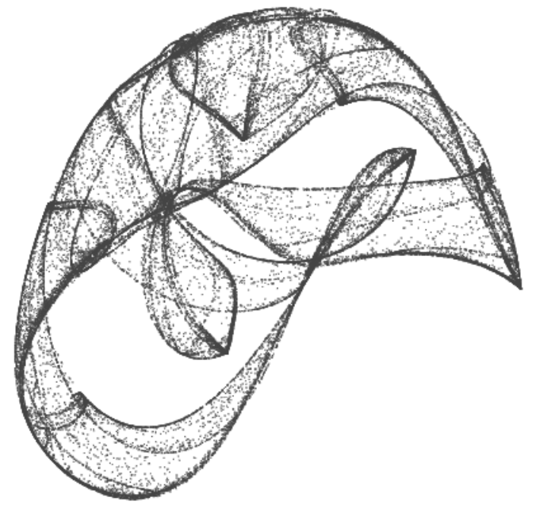

# ifs-js

An interpretation of the algorithms presented in the really cool talk [Generating Art In Many Worlds](https://www.youtube.com/watch?v=vLlbEZt-3j0&index=22&list=PLZdCLR02grLrKAOj8FJ1GGmNM5l7Okz0a) by Dan Lidral Porter at Clojure/West 2015 implemented in JavaScript. [See it in motion](http://jeffcarp.github.io/ifs-js/).

### Resources

- http://en.wikipedia.org/wiki/Iterated_function_system
